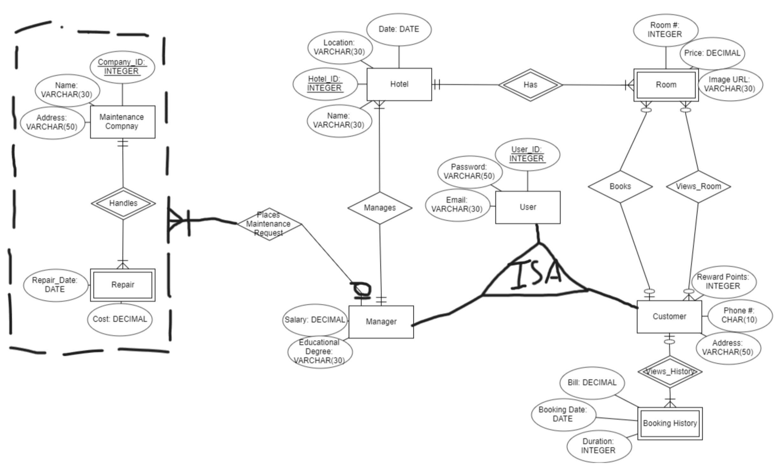

# Hotel Database Management System

## Introduction

For this project, my colleague and I modeled and built a Database Management System for a fictitious hotel chain. This system is capable of tracking various information regarding hotels, rooms, and customers. These include a customer's recent booking history, a manager's ability to place Room Repair Requests, and the ability for all clients to book a room. A description of all the functionalities of the client interface can be found in this file.

To complete the client interface, we used the Java Database Connectivity (JDBC) tool and the Command Line Interface (CLI). A template of the Java User Interface code was given to us by Dr. Vassilis Tsotras in order to accelerate the setup process. This includes creating a class that defines an embedded SQL utility class that is designed to work with PostgreSQL JDBC drivers. The rest of the functionality was completed by my colleague and I in the Hotel.java file.

## Entity-Relationship Diagram

The following is our Entity-Relationship (ER) diagram for our database. This diagram allowed us to have a visual representation of how all the hotel and customer data is organized. 

    

The following is a list of assumptions that we made when constructing this ER Diagram:

* Viewing and booking a room are two different relationships that a customer can have
* “View Room” and “Books” relationships are optional for all entities that participate in these relationships
* Manager can place multiple Maintenance Requests
* A repair that was made due to a Maintenance Request can only be made by one manager 
* A manager placing a Maintenance Request is optional
* A repair that was made due to a Maintenance Request is mandatory in the aggregation

The following is a table of Cardinality Constraints and Participation Constraints. Here, 'CC' stands for Cardinality Constraint and'PC' stands for Participation Constraint

| Entity A | Relationship | Entity B | CC | A's PC | B's PC |
|:----------:|:----------:|:----------:|:----------|:----------:|:----------:|
| Hotel  | has  | Room | one-to-many | mandatory | mandatory |
| Manager   | manages   | Hotel | one-to-many | mandatory | mandatory |
| Manager | places maintenance request | "handles" aggregation | one-to-many | optional | mandatory|
| Customer | books | Room | one-to-many | optional | optional |
| Customer | views room | Room | many-to-many | optional | optional |
| Customer | views history | Booking History | one-to-many | optional | mandatory |
| Maintenance Company | handles | Repair | one-to-many | mandatory | mandatory |

## Functionality

The following summarizes all of the functionalities of our database. The SQL queries can be found in the Hotel.java file in the src folder under the java directory. For most of these functions, we implemented various user input checks to deal with unexpected inputs as well as prohibited inputs. Overall, we feel that our user interface quality is clean and easily readable.

* main(String[] args)
    * The main function will display a greeting to the user who is trying to access the hotel chain application
    * Once the user is logged in to their profile, a different Main Menu will appear depending on whether the user is a manager or a customer
    * From there, the user can choose what they would like to do 

* CreateUser(Hotel esql)
    * This function will allow a new user to create a new customer profile
    * The new user must provide their name and provide a password for their profile
    * The new user will also be given a user ID to access their profile

* LogIn(Hotel esql)
    * This function checks the log-in credentials of an existing user 
    * If the credentials are incorrect or do not exist, an error message is displayed

* viewHotels(Hotel esql)
    * This function gives the user a list of hotels that are within 30 units distance from the given user's input location
    * The form of the input location is in latitude and longitude
    * A function call is made to calculateDistance() using the user's latitude and longitude values as well as the latitude and longitude values of all the hotels in the hotel chain
    * Only hotels who have a value less than or equal to 30 after calling calculateDistance() will be shown.

* viewRooms(Hotel esql)
    * This function allows the user to view the rooms available at each hotel
    * The user must give the hotel ID and date they are interested in to the function
    * A list of available rooms and a list of unavailable rooms will be displayed to the user

* bookRooms(Hotel esql)
    * This function allows the user to book a room at a hotel of their choice
    * The user is then asked to pick a specific check-in date for the room of their choice
    * The availability of this room will be checked. If available, the user will be given the option to book. If unavailable, the user will be asked to try again with either a different hotel, room, or date.

* viewRecentBookingsFromCustomer(Hotel esql)
    * This function allows the user to view up to five of their last most recent bookings
    * The user's customer ID is used to search through the RoomBookings and Rooms relations
    * The hotel ID, room number, room price, and booking date will be displayed for up to five of their last most recent bookings

* updateRoomInfo(Hotel esql)
    * This function allows a manager to update the price and/or the image URL of any room in a hotel that they specifically manage
    * The Rooms relation will get updated if the manager decides to do any of these actions
    * The RoomUpdatesLog relation will also be updated to include this recent change

* viewRecentUpdates(Hotel esql)
    * This function allows a manager to see up to five of the latest updates made to any of the hotels that they specifically manage
    * The RoomUpdatesLog relation will be used to retrieve the manager ID, hotel ID, room number, and the date that the room information was updated on
    
* viewBookingHistoryofHotel(Hotel esql)
    * This function allows a manager to view the booking history of any hotel that they specifically manage
    * The manager has the option of viewing the booking history of their hotels from within a certain range of dates or all of it
    * The booking ID, hotel ID, booking date, customer name, and room number will be displayed to the manager
    
* viewRegularCustomers(Hotel esql)
    * This function allows a manager to view the top five customers who made the most bookings in a hotel that they specifically manage
    * The customer ID, customer name, and the number of bookings will be displayed to the manager

* placeRoomRepairRequests(Hotel esql)
    * This function allows a manager to place a room repair request for a room that is in one of the hotels that they manage
    * The manager must provide the hotel ID, room number, and the company ID of the maintenance company that will be fulfilling this request
    * The RoomRepairs and RoomRepairRequests relations will also be updated to include this recent repair request

* viewRoomRepairHistory(Hotel esql)
    * This function allows a manager to view all of the room repair requests history for all the hotels that they specifically manage
    * The hotel ID, room number, repair date, and company ID of the maintenance company who did the repair will be displayed

## Output

The executeQueryAndReturnResult() function is used to execute an input query SQL instruction as well as issue the query to the DBMS. The function then returns the results as a list of records. These results can then be printed out to the console in a specific format depending on the function.